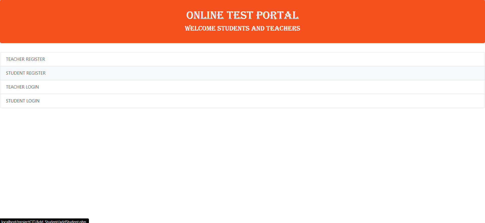

# Test-Evaluator

A DBMS with Front-End Integration

This project is a web-based application that allows staffs and students to create and take tests online. It uses PHP for back-end integration, HTML and CSS for front-end design, and MySQL for database management. The project aims to provide a convenient and efficient platform for testing and evaluation.

<center>
    
</center>

## Tech-Stack

- PHP (Back-end Integration)
- HTML (Front-end)
- CSS (Front-end)
- Mysql (Database)


## Features

- Staffs can register, login, create tests and set question papers.
- Students can register, login and attend tests.
- The application automatically grades the tests and provides feedback to the students.
- The application stores the test results, the student records and the teacher records in the database.

## Installation and Usage

To install and run this project, you need to have the following requirements:

- A MySQL database server
- A Wamp server
- A web browser (such as Chrome or Firefox)

To download the code files for this project, you can clone this GitHub repository using the following command:

```git clone https://github.com/Amritha-07/Test-Evaluator.git```

